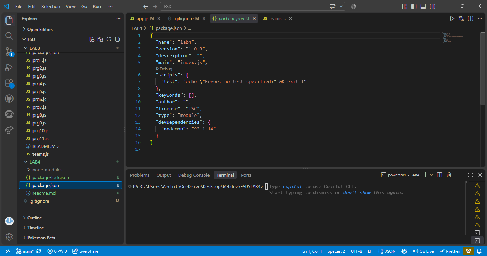
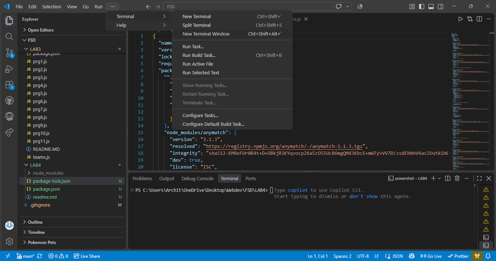

1. Create project folder.
2. Right click on project folder and select open in Integrated Terminal.
    
3. Type in terminal npm init -y press enter.
4. Open package.json file from project folder.
5. Update type as module in package.json
    